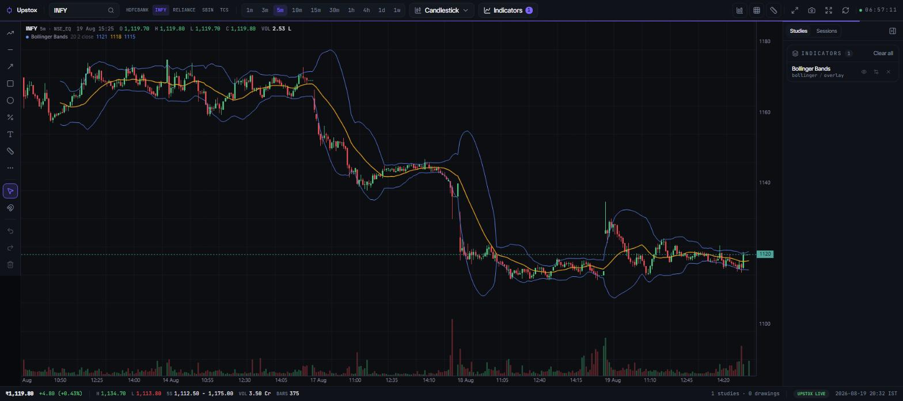

# Upstox Visualizer

A full-screen charting terminal for Upstox: OAuth login, the complete NSE, BSE and
MCX instrument master in SQLite, and a canvas charting engine with 86 technical
indicators, 43 drawing tools and 19 chart types.

FastAPI + SQLite on the backend, React 19 + openalgo-charts on the frontend.
No `.env` file: credentials live in the SQLite database and are entered through
the setup screen.



## What it does

- **Search 124,000+ instruments.** The full Upstox BOD master across 12 segments,
  downloaded into SQLite after login. Ranked typeahead: exact ticker first, cash
  and index ahead of derivatives, option and future chains ordered by nearest
  expiry.
- **Chart anything you find.** Search results carry their `instrument_key`, so an
  index or a specific option contract charts as itself with no ambiguity.
- **86 indicators** across Trend, Momentum, Volatility and Volume, each with a
  settings form generated from its descriptor rather than hand written.
- **43 drawing tools**: trend lines, Fibonacci, Gann, channels, cycles, position
  tools, brushes, with magnet snapping and undo.
- **19 chart types**, including Heikin Ashi, Renko, Range, Line Break, Point and
  Figure and Kagi.
- **Intervals from 1m to 1w**, served from Upstox and cached in SQLite so the
  chart still renders after the access token expires.
- **Layout persistence** per symbol: indicators, drawings, viewport and chrome
  come back when you return to an instrument.

## Stack

| Layer | Choice |
| --- | --- |
| Backend | FastAPI, Uvicorn, httpx, Pydantic v2, Python 3.11+ |
| Storage | SQLite through the standard library, no ORM |
| Frontend | React 19, TypeScript, Vite 8, Tailwind CSS v4, shadcn/ui on Radix |
| Charts | [openalgo-charts](https://github.com/marketcalls/openalgo-charts), a dependency-free canvas engine |
| Packaging | `uv` for Python, npm for the frontend |

```
upstox-visualizer/
  backend/            FastAPI service, SQLite storage, Upstox REST client
    app/
      config.py       endpoints, IST offset, seeded instruments
      db.py           schema + seed
      store.py        credentials, sessions, candles, instrument master
      upstox.py       async Upstox client
      routers/        settings, auth, market
    run.py            python run.py -> http://127.0.0.1:8000
  frontend/
    src/
      lib/
        chart-terminal.ts   the chart orchestration class, no React inside
        chart-catalog.ts    chart kinds and intervals
      components/chart/     canvas, indicator menu, drawing rail, search
      pages/chart.tsx       the terminal shell
  UPSTOX-NOTES.md     engineering notes on the Upstox API
```

The chart lives in a plain `ChartTerminal` class with no React import. React owns
the shell and calls into it, so a 60 fps crosshair never enters React state.

## 1. Register the redirect URL on Upstox

The redirect URL is where Upstox sends the authorization code after you log in.
It has to be registered on your Upstox app **before** the first login, and it
must match what this backend listens on exactly.

```
http://127.0.0.1:8000/api/auth/callback
```

1. Open <https://account.upstox.com/developer/apps> and create an app.
2. Paste the URL above into the **Redirect URI** field.
3. Save the app, then copy the **API key** and **API secret**.

Things that break the login:

| Rule | Why |
| --- | --- |
| Exact string match | `127.0.0.1` and `localhost` are different URLs to Upstox. |
| No trailing slash | Register `/api/auth/callback`, not `/api/auth/callback/`. |
| Keep the port | If you change the port in `backend/app/config.py`, re-register. |
| Avoid `.php` | Upstox filters redirect URLs ending in `.php`. |
| `http` is fine locally | Upstox accepts plain http on a loopback address. |

## 2. Run it

```powershell
cd backend
uv sync
uv run python run.py
```

```powershell
cd frontend
npm install
npm run build
```

Then open <http://127.0.0.1:8000>. The API and the built frontend are served from
one origin on port 8000.

For frontend work, `npm run dev` starts Vite on port 5173 with hot reload and
proxies `/api` to the backend. Both modes work with the same registered redirect
URL: the login flow carries the calling origin through the OAuth `state`
parameter.

`start.ps1` does the build-then-serve sequence in one step.

## 3. Connect

1. Go to **Setup**, paste the API key and secret, save.
2. Click **Log in with Upstox** and complete the login.
3. You land on **Chart**. The instrument master downloads in the background.

Access tokens expire at 3:30 AM IST the day after they are issued. The hairline
under the toolbar drains as the token burns down.

## API

| Method | Path | Purpose |
| --- | --- | --- |
| GET | `/api/settings` | Stored credentials, secret masked |
| POST | `/api/settings` | Save API key, secret and redirect URL |
| GET | `/api/auth/login-url` | Build the Upstox authorization URL |
| GET | `/api/auth/login` | Redirect to the Upstox login page |
| GET | `/api/auth/callback` | OAuth callback, exchanges the code for a token |
| GET | `/api/auth/status` | Connection state and seconds to token expiry |
| POST | `/api/auth/logout` | Invalidate the token and clear the local session |
| GET | `/api/market/instruments` | The curated shortlist |
| POST | `/api/market/instruments/refresh` | Re-resolve the shortlist from the NSE file |
| POST | `/api/market/instruments/download` | Download the full master in the background |
| GET | `/api/market/instruments/status` | Sync state and per-segment counts |
| GET | `/api/market/search` | Ranked instrument typeahead |
| GET | `/api/market/candles` | Candles plus per-session summaries |

Interactive docs: <http://127.0.0.1:8000/docs>

## Instrument master

`POST /api/market/instruments/download` fetches
`assets.upstox.com/market-quote/instruments/exchange/complete.json.gz`, which is
a public asset and needs no access token, then rebuilds `instrument_master` in
one transaction. About 125,000 rows land in roughly three seconds.

| Segment | Rows |
| --- | --- |
| NSE_FO | 35,584 |
| NSE_COM | 28,187 |
| MCX_FO | 15,931 |
| BSE_EQ | 12,696 |
| NSE_EQ | 9,655 |
| BCD_FO | 9,304 |
| NCD_FO | 8,844 |
| BSE_FO | 4,308 |
| NSE_INDEX | 139 |
| BSE_INDEX | 77 |
| GLOBAL_INDEX | 10 |
| GLOBAL_INDICATOR | 3 |

Counts from a 2026-08-19 download. Upstox refreshes the file daily around 6 AM.

Two field quirks worth knowing, both handled at ingest: `expiry` arrives as epoch
milliseconds and is stored as an IST `YYYY-MM-DD` string, and `tick_size` is
published in paise, so divide by 100 before showing a rupee tick.

## Tables

| Table | Contents |
| --- | --- |
| `app_settings` | Single row: API key, secret, redirect URL |
| `broker_session` | Single row: access token, profile, issue and expiry timestamps |
| `instruments` | The curated shortlist with friendly names |
| `instrument_master` | The full Upstox BOD master, rebuilt on each download |
| `instrument_sync` | State of the last master download |
| `candles` | OHLCV cache keyed by instrument, unit, interval, timestamp |
| `sync_log` | One row per successful fetch |

To start over, stop the backend and delete `backend/upstox.db`. That erases the
stored credentials and token, so you will have to set up and log in again.

## Security

`backend/upstox.db` holds your API key, API secret and access token in plain
text. It is gitignored and must never be committed or shared. Anyone with that
file can trade on your account until the token expires.

## License

MIT. See [LICENSE](LICENSE).

Charts are rendered by [openalgo-charts](https://github.com/marketcalls/openalgo-charts),
which is Apache-2.0.
